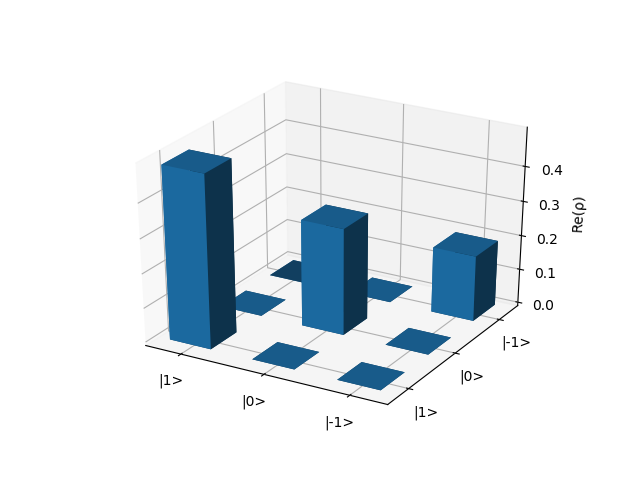
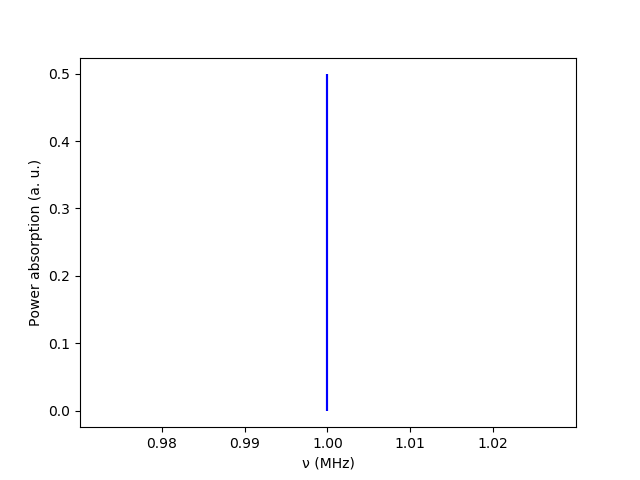
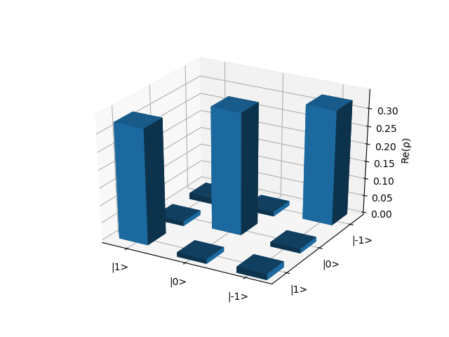
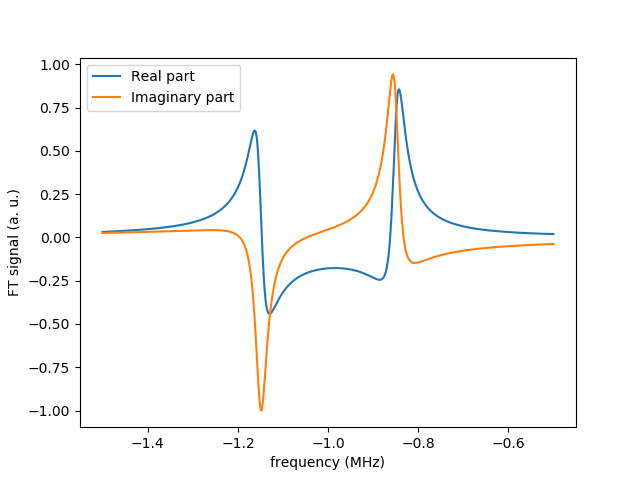
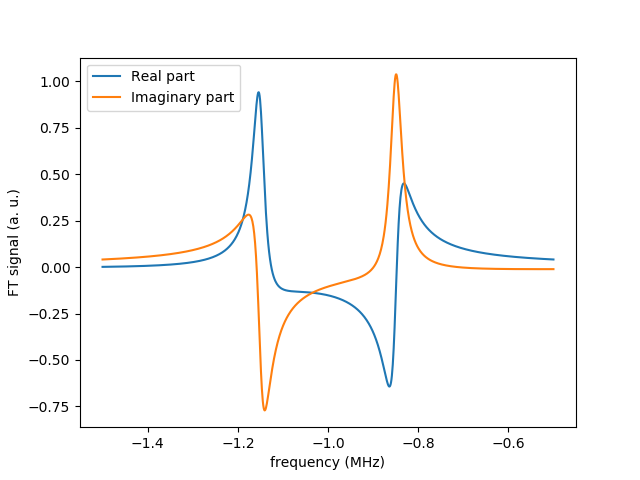
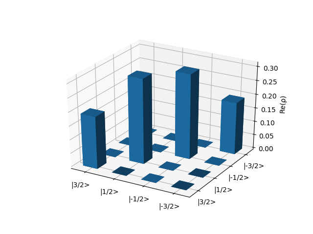
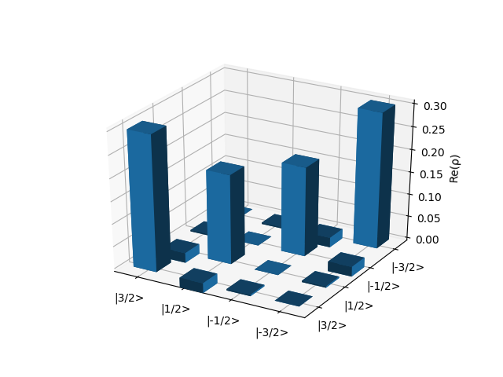
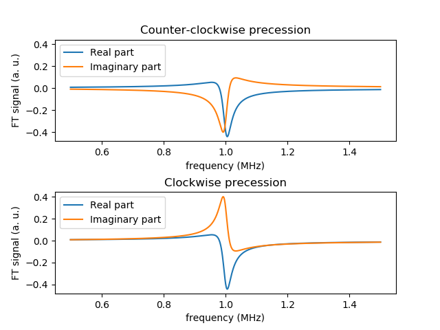

# NQR-NMR Simulation Software

## Author: Davide Candoli (Università di Bologna)

This project consists of a software which simulates a typical nuclear quadrupole/magnetic resonance experiment on a solid state sample, describing the dynamics of nuclear spins in condensed matter under the effect external magnetic fields and reproducing the traditional results observed in laboratory.

## Physics background

Each atomic nucleus in a single crystal is endowed with an intrinsic angular momentum, named spin, and a corresponding intrinsic magnetic moment. The interaction between this latter and any applied magnetic field provides a means for the manipulation of nuclear spins and the study of the magnetic properties of a sample.

One basic assumption of the simulations implemented by this program is that the spins under study belong to a periodic crystal where the set of nuclei can be treated as an ideal *statistical ensemble*: this allows to describe the whole many-spin system appealing to the *mixed state* of a single spin. Thus, the Hilbert space of the problem reduces to the 2s+1-dimensional space of a single spin, where each state is represented by a mixed density matrix.

Let us consider such a system under the effect of a static magnetic field. In these circumstances, the degeneracy of spin states is broken and they arrange into equally spaced energy levels, with an energy separation determined by the strength of the field and the gyromagnetic ratio of the nuclear spin.

In order to induce transitions between these states, a pulsed electromagnetic wave must have a frequency tuned with the resonance frequency of the system. This is the concept at the basis of the nuclear magnetic resonance (NMR) technique.

In nuclear quadrupole resonance (NQR), what lifts the degeneracy of spin states is the quadrupolar interaction between the charge distribution of the nucleus and the electric field gradient (EFG) due to the surrounding electron cloud. The applied electromagnetic pulses succeed in turning the spin's direction only if their frequency coincides with one of the several resonance frequencies of the system.

In general, experiments deal with intermediate situations between NMR and NQR, where both the interaction with the magnetic field (Zeeman interaction) and with the EFG (quadrupolar interaction) must be taken into account in order to determine the energy spectrum.

In order to extract information about the interactions of nuclear spins and the magnetic properties of the sample, NMR and NQR serve as successful techniques of investigation. Indeed, after the application of the designed pulse sequence, the system's magnetization typically has a non-zero component in the direction of the coil employed for the generation of the pulse. This component changes with time in a way that depends on the microscopic properties of the nuclei, and progressively goes to zero due to the unavoidable dephasing of different spins, which takes place with a characteristic time T<sub>2</sub> called *coherence time*.

The time dependence of the magnetization is measured through the acquisition of the current induced in the coil. Then, performing the Fourier analysis of this signal, one is able to extract a lot of information about the system, according to the position of the peaks of the spectrum, their shape and their sign.

### Unit standard of the software

In order to save processing power and lighten calculations, a suitable choice of units of measure has been taken.

**Remark:** In the whole program, energies and frequencies are considered quantities with the same physical dimensions. The identification between them is a consequence of setting the Planck constant h (originally the proportionaly constant for the conversion from frequencies to energies) equal to 1.

The standard units employed in the software are listed below.

| physical quantity  | unit  |
| ------------------ | ----- |
| gyromagnetic ratio | MHz/T |
|   magnetic field   |   T   |
|  energy/frequency  |  MHz  |
|    temperature     |   K   |
|        time        |   us  |

Angles do not have a standard unit: they are measured in radians when they are passed directly to the software's functions, while they are measured in degrees when they are inserted in the GUI.

## Software

### Prerequisites

The software has been written in Python 3.7.

The operative systems where the code has been tested and executed are
* Ubuntu
* Windows 10 (through the Spyder interface provided by the distribution Anaconda)

The program makes wide use of many of the standard Python modules (namely `numpy`, `scipy`, `pandas`, `matplotlib`) for its general purposes.

Tests have been carried out using the `pytest` framework and the `hypothesis` module.

`pytest` -> https://docs.pytest.org/en/stable/

`hypothesis` -> https://hypothesis.readthedocs.io/en/latest/

The GUI has been implemented with the tools provided by the Python library `kivy`.

`kivy` -> https://kivy.org/#home

In order to run the GUI, it is required the additional installation of the module `kivy.garden` and `garden.matplotlib.backend_kivy`.

`kivy.garden` -> https://kivy.org/doc/stable/api-kivy.garden.html

`garden.matplotlib.backend_kivy` -> https://github.com/kivy-garden/garden.matplotlib/blob/master/backend_kivy.py

### Modules of the software

The program is made up by 6 modules. Each of them is described in full detail in the wiki page of the repository of GitHub which hosts the project:

https://github.com/DavideCandoli/NQR-NMRSimulationSoftware/wiki

Below, the content and usage of these modules is reported briefly:

* `Operators`

  This module, together with `Many_Body`, is to be considered a sort of toolbox for the simulations of generic quantum systems. It contains the definitions of the classes and functions related to the basic mathematical objects which enter the treatment of a quantum system. `Operators` focuses on the properties of a single system, while `Many_Body` extends these features to systems made up of several particles.
  
  The classes and subclasses defined in `Operators` belong to the following inheritance tree
  
  * `Operator`
    * `Density_Matrix(Operator)`
    * `Observable(Operator)`
    
  Class `Operator` defines the properties of a generic linear application acting in the Hilbert space of a finite-dimenstional quantum system. Its main attribute is `matrix`, a square array of complex numbers which gives the matrix representation of the operator in a certain basis. The methods of this class implement the basic algebraic operations and other common actions involving operators, such as the change of basis.
  
  Class `Density_Matrix` characterizes the operators which represent the state (pure or mixed) of the quantum system. It is defined by three fundamental properties:
  1. hermitianity
  1. unit trace
  1. positivity

  Class `Observable` characterizes the hermitian operators which represent the physical quantities of the system.
  
  Other functions defined in this module perform:
  * the calculation of the first few terms of the Magnus expansion of a time-dependent Hamiltonian, which turn useful in the approximation of the evolution operator; 
  * the calculation of the canonical density matrix corresponding to the equilibrium state of a system at the specified temperature.


* `Many_Body`

  This module contains two function definitions which allow to pass from a single particle Hilbert space to a many particle space and viceversa.
  
  * `tensor_product_operator`
  
    Takes two operators of arbitrary dimensions and returns their tensor product.
    
  * `partial_trace`
  
    Takes an operator acting on the Hilbert space of a many-particle system and extracts its partial trace over the specified subspace.
    
  **Remark:** These functions have been tested working properly, but up to now no simulation has been carried out which makes use of them. Anyway, new simulations may rely on these functions, so they have been included anyway in the program.


* `Nuclear_Spin`

  In this module, the definitions of `Operators` are employed to build up the class which represents a spin of an atomic nucleus.
  
  Class `Nuclear_Spin` is characterized by a quantum number, a gyromagnetic ratio and a set of methods which return the spherical and cartesian components of the spin vector operator.


* `Hamiltonians`

  This file is dedicated to the definitions of the functions which return the pieces of the Hamiltonian of a nuclear spin system in an NMR/NQR experiment.
  
  * `h_zeeman`
    
    Builds up the Hamiltonian of the interaction between the spin and an external static magnetic field, after its magnitude and direction has been given.
    
  * `h_quadrupole`
  
    Builds up the Hamiltonian of the interaction between the nuclear electric quadrupole momentum and the EFG, after the coupling constant of the interaction, the asymmetry of the EFG and the direction of its principal axes have been given.
    
    This function calls in turn the functions `v0_EFG`,`v1_EFG`, `v2_EFG` for the computation of the spherical components of the EFG tensor, which enter the expression of the quadrupole Hamiltonian.
    
  * `h_single_mode_pulse`
  
    Returns the Hamiltonian of interaction of a spin with a linearly polarized electromagnetic wave, once the properties of the wave and the time of evaluation have been passed.
    
    This function is called by `h_multiple_mode_pulse`, which returns the Hamiltonian of interaction with a superposition of pulses.
    
    In turn, `h_multiple_mode_pulse` is called inside `h_changed_picture`, which, in the given instant of time, evaluates the full Hamiltonian of the system (comprised of the Zeeman, quadrupole and time-dependent contributions) and returns the same Hamiltonian expressed in a different dynamical picture. This passage is required by the implementation of the evolution of the system, which is described later.


* `Simulation`

  This module provides the definition of the functions which actually implement the various tasks of the simulation. A user whose aim is to perform simulations of NMR/NQR experiments of the kind discussed in the examples which follow just needs to learn how to use the functions in this module. More sophisticated simulations are possible, but they require a deeper knowledge of the features of the program, as the user should deal directly with the definitions in the other modules.
  
  The order in which the definitions in `Simulation` appear suggests the ideal progression of the various steps of the simulation.

  1. `nuclear_system_setup`
  
     Builds up the system under study, building the objects associated with the nuclear spin, the unperturbed Hamiltonian (Zeeman + quadrupole contributions) and the initial state.      
  
  1. `power_absorption_spectrum`
  
     Produces the intensity of power absorption for each pulse's frequency in resonance with the system.
    
  1. `evolve`
  
     Evolves the state of the system under the action of the specified electromagnetic pulse. The evolution is carried out using the Magnus expansion of the Hamiltonian of the system cast in the specified dynamical picture.

  1. `FID_signal`
  
     Simulates the free induction decay signal generated by the magnetization of the system after the application of a pulse.
    
  1. `fourier_transform_signal`
  
     Performs the Fourier analysis of a signal (in this context, the FID).
    
  1. `fourier_phase_shift`
  
     Computes the phase to be added to the FID in order to correct the shape of the Fourier spectrum of the system.
    
  Besides these functions, which execute the main computations of the simulation, the module contains the functions for the plot and visualization of the results.
    
### Examples of execution

#### Pure Zeeman experiment

The simplest experiment one can simulate is the case of pure NMR, where a static magnetic field (conventionally directed along z) is applied to a nucleus where the quadrupolar interaction is negligible.

Take for instance a spin 1 nucleus: the set up of the system is carried out passing to `nuclear_system_setup` the following parameters:
```
spin_par = {'quantum number' : 1.,
            'gamma/2pi' : 1.}
    
zeem_par = {'field magnitude' : 1.,
            'theta_z' : 0.,
            'phi_z' : 0.}
    
quad_par = {'coupling constant' : 0.,
            'asymmetry parameter' : 0.,
            'alpha_q' : 0.,
            'beta_q' : 0.,
            'gamma_q' : 0.}
                
spin, h_unperturbed, dm_0 = nuclear_system_setup(spin_par, zeem_par, quad_par, initial_state='canonical', temperature=1e-4)

plot_real_part_density_matrix(dm_0)
```
where the initial state has been set to be at thermal equilibrium at a temperature of 10<sup>-3</sup> K.


Then, the power absorption spectrum can be simulated running the functions
```
f, p = power_absorption_spectrum(spin, h_unperturbed, normalized=True)

plot_power_absorption_spectrum(f, p)
```


In order to apply a 90° pulse to the system, which rotates the magnetization from the z-axis to the x-y plane, we shall design a pulse in resonance with the system such that the product

gyromagnetic ratio x pulse field magnitude x pulse time

is equal to pi/2. Setting a pulse made up of the single linearly polarized mode
```
mode = pd.DataFrame([(1., 0.1, 0., math.pi/2, 0.)], 
                     columns=['frequency', 'amplitude', 'phase', 'theta_p', 'phi_p'])
```
the pulse time should be equal to 5 us in order to produce a 90° rotation. Thus, the effective amplitude of the wave is 0.05 us: the linearly polarized mode splits into two rotating waves, one of which is in resonance with the system, the other off-resonance.

Then, the state of the system is evolved and plotted with the following calls:
```
dm_evolved = evolve(spin, h_unperturbed, dm_0, \
                    mode=mode, pulse_time=5, \
                    picture = 'IP')
    
plot_real_part_density_matrix(dm_evolved)
```



The evolved density matrix can be employed to generate the FID signal of the system as follows:
```
t, fid = FID_signal(spin, h_unperturbed, dm_evolved, acquisition_time=500, T2=100)

plot_real_part_FID_signal(t, fid)
```


And in turn the Fourier analysis of this signal produces the NMR spectrum:
```
f, ft = fourier_transform_signal(t, fid, -1.5, -0.5)
    
plot_fourier_transform(f, ft)
```


#### Perturbed Zeeman experiment

When the quadrupolar interaction is non-negligible, but still very small compared to the interaction with the magnetic field, one is in the so-called *perturbed Zeeman* regime.

An experiment with these conditions can be easily simulated following the same steps described in the pure Zeeman case with the only difference being a non-zero quadrupolar coupling constant:

```
quad_par = {'coupling constant' : 0.1,
            'asymmetry parameter' : 0.,
            'alpha_q' : 0.,
            'beta_q' : 0.,
            'gamma_q' : 0.}
```

The presence of this perturbation leads eventually to a spectrum with two resonance peaks.


As one can see, the real and imaginary parts of the spectrum at each peak don't fit the conventional absorptive/dispersive lorentzian shapes, which would be a nice feature to be visualized. By means of the function `fourier_phase_shift`, one can obtain the phase for the correction of the shape of the spectrum at a specified peak (the simultaneous correction at both peaks is impossible on principle):
```
phi = fourier_phase_shift(f, ft, peak_frequency_hint=-0.9)

f, ft_correct = fourier_transform_signal(t, np.exp(1j*phi)*fid, -1.5, -0.5)

plot_fourier_transform(f, ft_correct)
```


#### Pure NQR experiment

Another important category of experiments is the case of *pure NQR*, where the only term of the unperturbed Hamiltonian is the quadrupolar interaction. Such an experiment can be simulated changing the parameters in the previous two examples as
```
spin_par = {'quantum number' : 3/2,
            'gamma/2pi' : 1.}
    
zeem_par = {'field magnitude' : 0.,
            'theta_z' : 0.,
            'phi_z' : 0.}
    
quad_par = {'coupling constant' : 2.,
            'asymmetry parameter' : 0.,
            'alpha_q' : 0.,
            'beta_q' : 0.,
            'gamma_q' : 0.}
```
where we have set the spin quantum number to 3/2 and the coupling constant of the quadrupole interaction to 2 MHz.

In such a configuration, the pulse set up before turns out to be in resonance with the new system as well, so can be left unaltered.

The initial state is


while the evolved one is  


In this case, however, the resonant frequencies of the system are both 1 and -1 MHz, due to the characteristics of the pure quadrupolar energy spectrum, so both the rotating waves which the linearly polarized pulse splits into are able to induce transitions. In order to visualize properly both the positive and negative resonance line in the spectrum, the functions for the analysis of the FID must be run as follows:
```
f, ft, ft_n = fourier_transform_signal(t, fid, 0.5, 1.5, opposite_frequency=True)
    
plot_fourier_transform(f, ft, ft_n)
```



### GUI

### Acknowledgementes